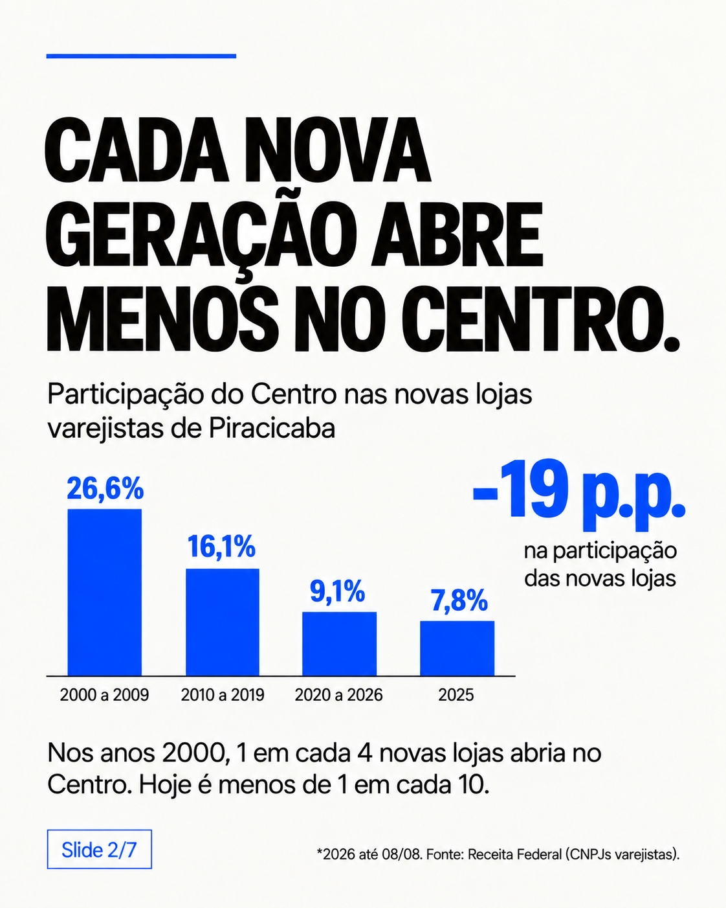
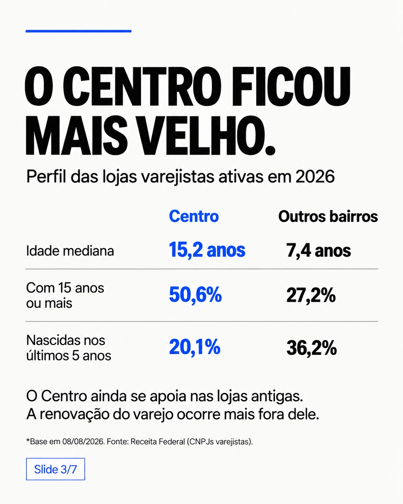
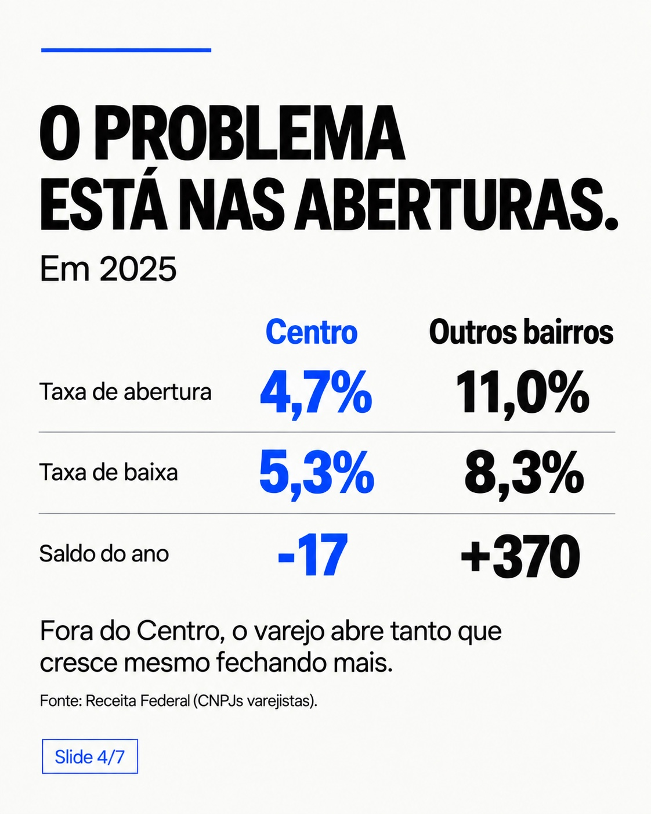
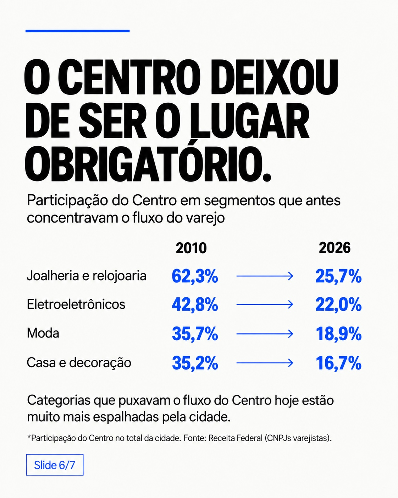

# E-commerce, varejo e o Centro de Piracicaba

Projeto de análise de dados sobre a transformação do varejo físico em Piracicaba (SP), com foco na perda de participação do Centro nas novas lojas e na redistribuição espacial de segmentos mais expostos ao e-commerce.

A análise utiliza os **Dados Abertos do CNPJ da Receita Federal**, competência **2026-08**, e considera estabelecimentos varejistas da divisão **CNAE 47**.


## Principais achados

- A participação do Centro nas novas lojas varejistas caiu de **26,6% em 2000–2009** para **16,1% em 2010–2019**, **9,1% em 2020–2026** e **7,8% em 2025**.
- Entre os estabelecimentos não baixados em 08/08/2026, a idade mediana é de **15,2 anos no Centro** e **7,4 anos nos outros bairros**.
- Em 2025, o Centro teve **128 aberturas e 145 baixas**, saldo de **-17**; os demais bairros tiveram **1.522 aberturas e 1.152 baixas**, saldo de **+370**.
- Nos segmentos classificados com **alta exposição ao e-commerce**, o estoque de lojas entre 2019 e 2026 cresceu **4,3% no Centro** e **46,3% nos outros bairros**. Em 2025, o saldo desses segmentos foi **-21 no Centro** e **+172 nos demais bairros**.
- A participação do Centro caiu em categorias que historicamente concentravam fluxo: joalheria e relojoaria (**62,3% → 25,7%**), eletroeletrônicos (**42,8% → 22,0%**), moda (**35,7% → 18,9%**) e casa e decoração (**35,2% → 16,7%**) entre 2010 e 2026.

## Carrossel

As sete imagens abaixo correspondem às artes originais do projeto. Para que sejam exibidas corretamente no GitHub, devem ser enviadas exatamente para os caminhos indicados.

### 1. Capa


### 2. Participação do Centro nas novas lojas


### 3. Idade das lojas


### 4. Aberturas e baixas em 2025


### 5. Segmentos com alta exposição ao e-commerce


### 6. Mudança da participação do Centro por categoria


### 7. Resumo


## Arquivos para upload manual

Os arquivos que não foram enviados automaticamente pelo conector devem usar estes caminhos no repositório:

```text
assets/carousel/01-cover.jpeg
assets/carousel/02-new-stores-share.jpeg
assets/carousel/03-store-age.jpeg
assets/carousel/04-openings-closures-2025.jpeg
assets/carousel/05-high-ecommerce-exposure.jpeg
assets/carousel/06-category-share.jpeg
assets/carousel/07-summary.jpeg

data/varejo_piracicaba_analise_ecommerce.csv
```

O ZIP preparado para as imagens já contém a estrutura `assets/carousel/`. Basta extrair seu conteúdo na raiz do repositório ou enviar os arquivos mantendo esses mesmos caminhos.

## Estrutura do repositório

```text
assets/
  carousel/
    01-cover.jpeg
    02-new-stores-share.jpeg
    03-store-age.jpeg
    04-openings-closures-2025.jpeg
    05-high-ecommerce-exposure.jpeg
    06-category-share.jpeg
    07-summary.jpeg

data/
  varejo_piracicaba_analise_ecommerce.csv
  carousel_metrics.csv

docs/
  carousel.md
  methodology.md

notebooks/
  baixar_bases_receita_2026_08.ipynb

src/
  baixar_bases_receita_2026_08.py
  base_analitica_original.py
  reproduzir_carrossel.py

requirements.txt
```

## Definição territorial usada no carrossel

Para reproduzir os números finais do carrossel, a região **Centro** considera registros cujo bairro normalizado contém `CENTRO` e também as variantes de **Bairro Alto** presentes na base (`BAIRRO ALTO`, `B ALTO`, `B.ALTO`, `B. ALTO` e `ALTO`).

O arquivo `base_analitica_original.py` é preservado como foi fornecido. Nele, a coluna `eh_centro` marca apenas bairros cujo texto contém `CENTRO`. O script `reproduzir_carrossel.py` aplica a definição territorial utilizada na versão final da análise, sem alterar o script original.

## Reprodução

Instale as dependências:

```bash
pip install -r requirements.txt
```

A base analítica final deve ser enviada para:

```text
data/varejo_piracicaba_analise_ecommerce.csv
```

Depois execute:

```bash
python src/reproduzir_carrossel.py
```

As métricas resultantes podem ser conferidas em `data/carousel_metrics.csv` e na seção de validação de `docs/methodology.md`.

## Sobre as bases grandes

Os arquivos brutos `Estabelecimentos0.zip` a `Estabelecimentos9.zip` da Receita Federal não são versionados no repositório. O notebook e o script incluídos documentam como baixar e consolidar esses arquivos localmente.

## Fonte

Receita Federal do Brasil — Dados Abertos do CNPJ, competência 2026-08.

> A análise descreve a dinâmica cadastral dos estabelecimentos do CNPJ. "Abertura" usa `data_inicio_atividade`; "baixa" usa `data_situacao_cadastral` quando `situacao_cadastral = 08`. Os resultados não medem faturamento, fluxo de pedestres ou vendas do e-commerce diretamente.
